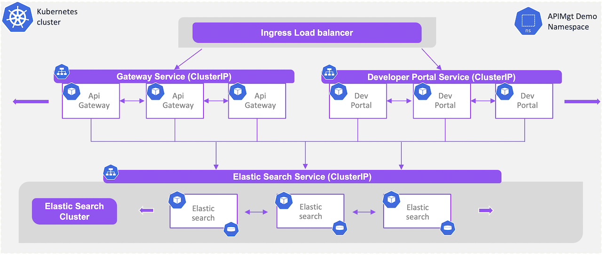
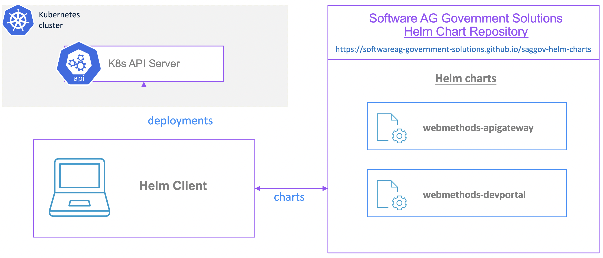
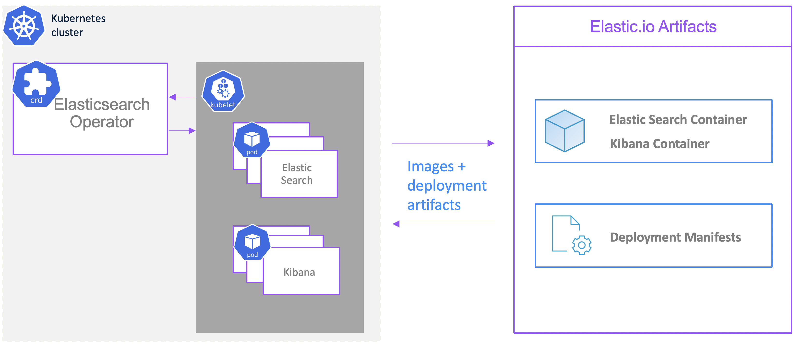
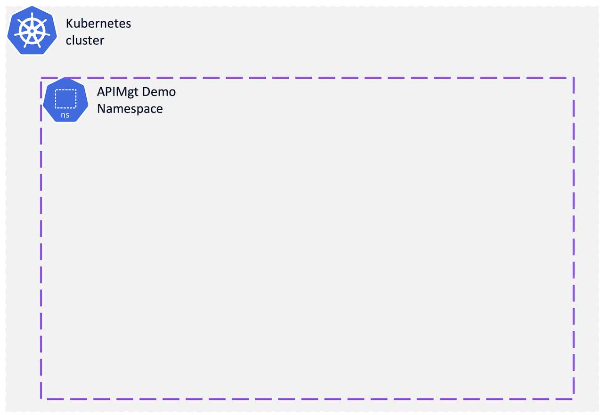
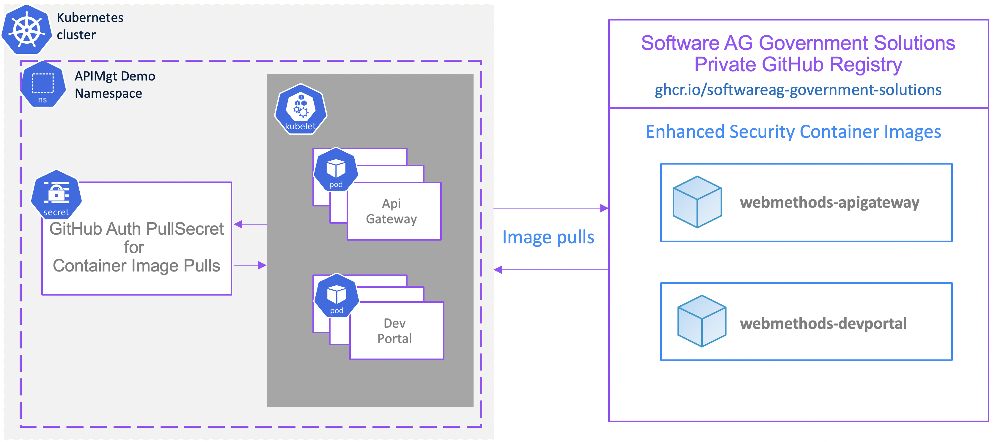
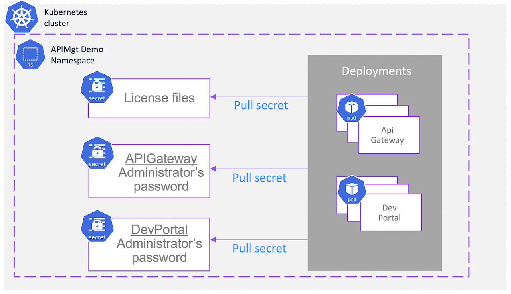

# webmethods APIGateway and Developer 10.11, Clustered in Kubernetes - Using Helm Charts 

This page will walk through the deployment of a realistic scalable API Management 10.11 cluster in your kubernetes environment:

 - 2 API Gateway runtime servers (clustered)
 - 2 Developer portal servers (clustered)
 - 3 Elastic Search servers (clustered)

 

## Prep steps

### Step 1) Install Helm CLI, and Add the Software AG Government Solutions HelmChart

We'll be using Helm to deploy the Software AG product stacks into our cluster.

 

So let's add the public Softwareag Government Solutions Helm-Chart repo for SoftwareAG products:

```bash
helm repo add saggov-helm-charts https://softwareag-government-solutions.github.io/saggov-helm-charts
helm repo update
```

### Step 2a) Preps for Install of ElasticSearch/Kibana IF using Elastic Operator

The sample deployment described in this page leverage the Elastic stack from Elastic.
For easy deployment of Elastic Search and Kibana, we'll be using the Elastic Kubernetes Operator called Elastic Cloud on Kubernetes (ECK).
Elastic Cloud on Kubernetes (ECK) is a Kubernetes operator to orchestrate Elastic applications (Elasticsearch, Kibana, APM Server, Enterprise Search, Beats, Elastic Agent, and Elastic Maps Server) on Kubernetes. 
See Elastic Cloud on Kubernetes (ECK) at https://www.elastic.co/guide/en/cloud-on-k8s/1.9/index.html for more details on that.

 


Installation Summary (version 1.9.1)
```bash
kubectl create -f https://download.elastic.co/downloads/eck/1.9.1/crds.yaml
kubectl apply -f https://download.elastic.co/downloads/eck/1.9.1/operator.yaml
```

### Step 2b) Preps for Install of ElasticSearch/Kibana IF using Elastic/Kibana Helm charts

All the elastic helm charts are at https://github.com/elastic/helm-charts

Add the helm chart repo for Elastic search:

```bash
helm repo add elastic https://helm.elastic.co
helm repo update
```

### Step 3) Create demo namespace

To keep things well contained, let's create a demo namespace for our deployed artifacts:

 

```bash
export DEMO_NAMESPACE=apimgt-cluster-demo
kubectl create ns $DEMO_NAMESPACE
kubectl config set-context --current --namespace=$DEMO_NAMESPACE
```

### Step 4) Add pull secrets for the container images

The container images in our GitHub Container Registry are not publically accessible. Upon access granted, you'll need to add your auth_token into a K8s secret entry for proper image pulling...

 

Here it the command:

```bash
kubectl create secret docker-registry saggov-ghcr --docker-server=ghcr.io/softwareag-government-solutions --docker-username=mygithubusername --docker-password=mygithubreadtoken --docker-email=mygithubemail
```

where: 
mygithubusername = your github username
mygithubreadtoken = your github auth token with read access to the registry
mygithubemail = your github email

### Step 5) Add secrets for the SoftwareAG products

 

#### Step 5a) Add the SoftwareAG products licenses as secrets

Each product require a valid license to operate. We'll add the valid licenses in K8s secrets so they can be used by the deployments.

First, download and copy the licenses into the following ./licensing directory:
 - ApiGateway Advanced
   - expected filename: "./licensing/apigateway-license.xml"
 - Developer Portal
   - expected filename: "./licensing/devportal-license.xml"

NOTE: Make sure to use the expected file name for the next "create secret" command to work.

```bash
kubectl create secret generic softwareag-apimgt-licenses \
  --from-file=apigateway-license=./licensing/apigateway-license.xml \
  --from-file=devportal-license=./licensing/devportal-license.xml
```

#### Step 5b) Add Secrets for the Application passwords

Let's create the secrets for the Administrator's passwords (API Gateway and Dev Portal)

API Gateway:

```bash
echo -n "Desired/New Administrator password: "; read -s password; export ADMIN_PASSWORD=$password
echo -n "Default/Old Administrator password: "; read -s passwordOld; export ADMIN_PASSWORD_OLD=$passwordOld
kubectl create secret generic softwareag-apimgt-apigateway-passwords --from-literal=Administrator=$ADMIN_PASSWORD --from-literal=AdministratorOld=$ADMIN_PASSWORD_OLD
```

Developer Portal:

```bash
echo -n "Desired/New Administrator password: "; read -s password; export ADMIN_PASSWORD=$password
echo -n "Default/Old Administrator password: "; read -s passwordOld; export ADMIN_PASSWORD_OLD=$passwordOld
kubectl create secret generic softwareag-apimgt-devportal-passwords --from-literal=Administrator=$ADMIN_PASSWORD --from-literal=AdministratorOld=$ADMIN_PASSWORD_OLD
```

## Deploy/Detroy stack

### Deploy stack

```bash
/bin/sh deploy.sh $DEMO_NAMESPACE
```

### Delete stack

```bash
/bin/sh destroy.sh $DEMO_NAMESPACE
```

## Manual steps

### Add ElasticSearch stack

NOTE: The command below rely on Elastic Cloud on Kubernetes (ECK) available and installed in the cluster. See section "Add Elastic Operator to Kubernetes cluster (if not there alteady)" for details on that.

Once ECK is installed, simply run the following 2 commands to install the elastic stack:

```bash
kubectl --namespace $DEMO_NAMESPACE apply -f elasticsearch.yaml
kubectl --namespace $DEMO_NAMESPACE apply -f kibana.yaml
```

### Add Developer Portal stack


```bash
helm upgrade -i --namespace $DEMO_NAMESPACE -f devportal.yaml devportal saggov-helm-charts/webmethods-devportal
```

### Add API Gateway stack

```bash
helm upgrade -i --namespace $DEMO_NAMESPACE -f apigateway.yaml apigateway saggov-helm-charts/webmethods-apigateway
```

### Uninstall Steps

```bash
helm uninstall --namespace $DEMO_NAMESPACE apigateway
helm uninstall --namespace $DEMO_NAMESPACE devportal

kubectl --namespace $DEMO_NAMESPACE delete -f elasticsearch.yaml
kubectl --namespace $DEMO_NAMESPACE delete -f kibana.yaml
```